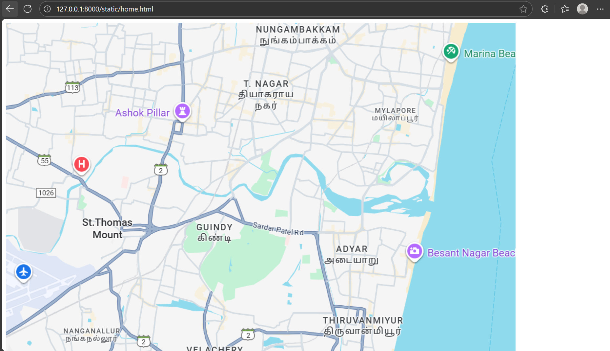
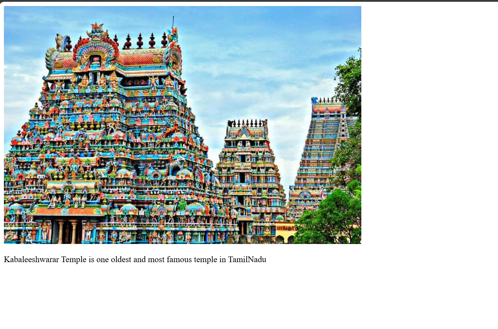
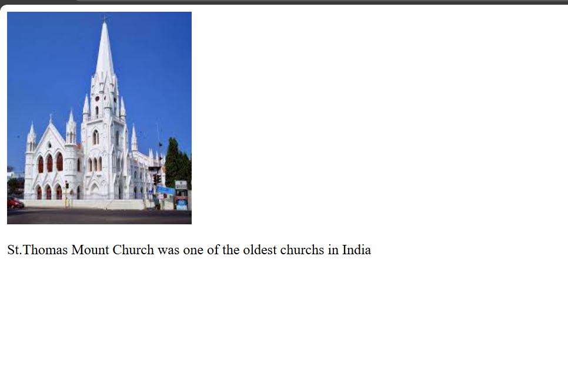
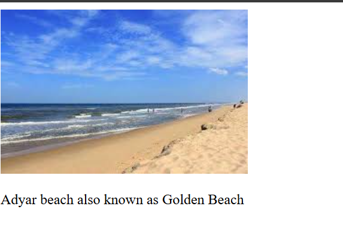

# Ex04 Places Around Me
## Date: 7.10.25

## AIM
To develop a website to display details about the places around my house.

## DESIGN STEPS

### STEP 1
Create a Django admin interface.

### STEP 2
Download your city map from Google.

### STEP 3
Using ```<map>``` tag name the map.

### STEP 4
Create clickable regions in the image using ```<area>``` tag.

### STEP 5
Write HTML programs for all the regions identified.


### STEP 6
Execute the programs and publish them.

## CODE
```
home.html
<!DOCTYPE html>
<html lang="en">
<head>
    <meta charset="UTF-8">
    <meta name="viewport" content="width=device-width, initial-scale=1.0">
    <title>Document</title>
</head>
<body>
    <!-- Image Map Generated by http://www.image-map.net/ -->


<map name="image-map">
    <area target="" alt="St.Thomas Mount" title="St.Thomas Mount" href="church.html" coords="110,359,309,481" shape="rect">
    <area target="" alt="Adyar Beach" title="Adyar Beach" href="beach.html" coords="713,458,83" shape="circle">
    <area target="" alt="Mylapore Temple" title="Mylapore Temple" href="temple.html" coords="741,127,815,128,860,169,861,196,819,241,750,249,701,218,709,169" shape="poly">
</map>
</body>
</html>

beach.html
<!DOCTYPE html>
<html lang="en">
<head>
    <meta charset="UTF-8">
    <meta name="viewport" content="width=device-width, initial-scale=1.0">
    <title>Document</title>
</head>
<body>
    
    <p>Adyar beach also known as Golden Beach</p>
</body>
</html>

temple.html
<!DOCTYPE html>
<html lang="en">
<head>
    <meta charset="UTF-8">
    <meta name="viewport" content="width=device-width, initial-scale=1.0">
    <title>Document</title>
</head>
<body>
    
    <p>Kabaleeshwarar Temple is one oldest and most famous temple in TamilNadu</p>
</body>
</html>

church.html
<!DOCTYPE html>
<html lang="en">
<head>
    <meta charset="UTF-8">
    <meta name="viewport" content="width=device-width, initial-scale=1.0">
    <title>Document</title>
</head>
<body>
    
    <p>St.Thomas Mount Church was one of the oldest churchs in India</p>
</body>
</html>
```
## OUTPUT






## RESULT
The program for implementing image maps using HTML is executed successfully.
